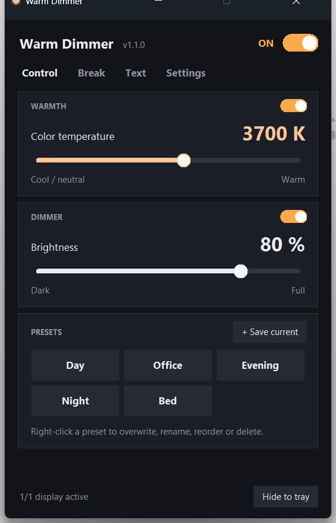
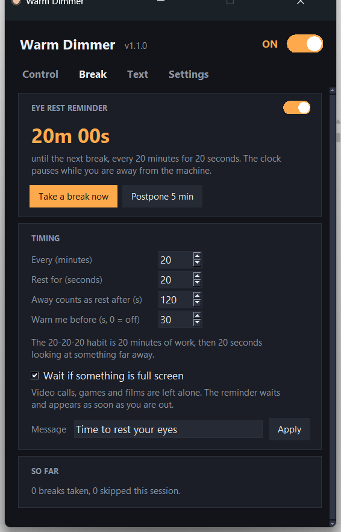
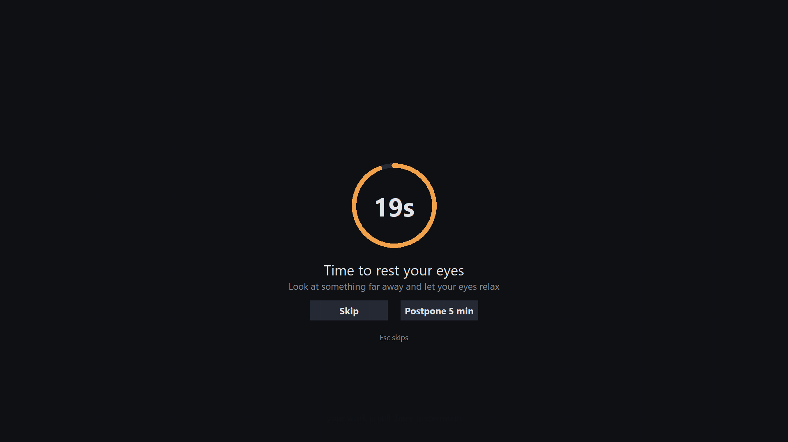
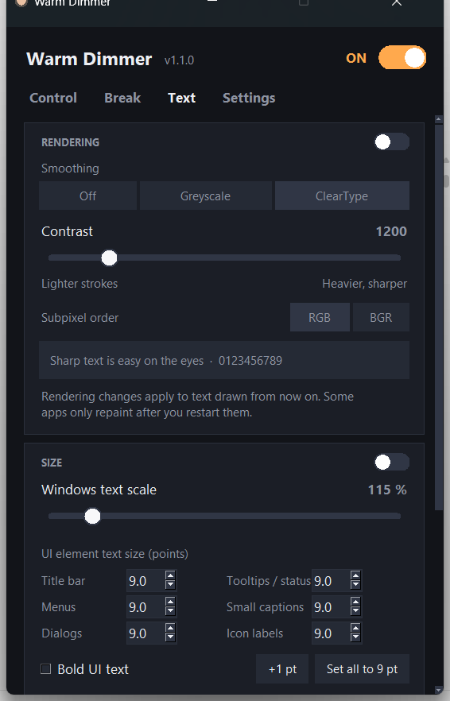
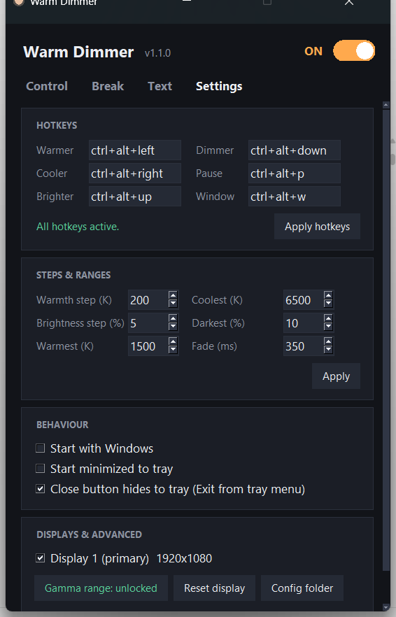

# Warm Dimmer

A small, free eye-comfort tool for Windows. It does four things and tries to do
each of them properly.

**[العربية](README.ar.md)**

| | |
|---|---|
| **Warm** | Colour temperature from 6500 K down to 1500 K |
| **Dimmer** | Screen brightness from 100% down to 10%, below what the monitor itself allows |
| **Break** | Eye-rest reminders on the 20-20-20 pattern, with a calm full-screen countdown |
| **Text** | Windows' own text rendering and UI font sizes: ClearType, stroke contrast, per-element sizes |

Warmth and dimming are written straight into the graphics card's gamma ramp, the
same path f.lux and CareUEyes use, so they cover everything on screen including
games, video and full-screen apps, with no overlay and no measurable cost.



## Install

Python 3.8 or newer on Windows 10/11.

```
pip install -r requirements.txt
```

Then double-click `WarmDimmer.pyw`. It starts in the tray with no console window.
If something goes wrong, run `WarmDimmer-debug.bat` to see the error.

For a single `.exe`, run `build_exe.bat` and look in `dist\`.

## Every function has its own switch

Each section carries its own toggle, because they do unrelated jobs and one
master switch for all of them is a blunt instrument.

| Switch | When it is off |
|---|---|
| **Warmth** | Colour returns to neutral, dimming keeps working |
| **Dimmer** | Brightness returns to 100%, warmth keeps working |
| **Eye rest reminder** | Reminders stop, nothing else changes |
| **Rendering** (Text tab) | Windows' own font rendering comes back |
| **Size** (Text tab) | Windows' own text sizes come back |
| **ON** in the header | Pauses warmth and dimming together |

The two Text sections start **off**, so the app does not touch a single Windows
setting until you ask it to. While a section is off you can still set everything
up inside it: values are remembered and applied the moment you flip the switch.

## Break reminders



Based on the 20-20-20 habit: every 20 minutes, look at something far away for 20
seconds. Both numbers are yours to change.



Two decisions separate a useful reminder from an irritating one:

**It does not count time you were not there.** Windows reports how long the
keyboard and mouse have been idle, so stepping away counts as a break already
taken. You will not sit back down to a reminder that was waiting for you.

**It never covers a full-screen app.** A video call, a game or a film is left
alone; the reminder waits and appears the moment you are out of it. This matters
most when you are sharing your screen in a meeting. You can turn that off if you
would rather always be interrupted.

Every break can be skipped or postponed, and `Esc` skips. **Take a break now**
works from the tray whenever you want one.

## Text clarity and size



This tab reaches what gamma cannot: the shape and size of Windows' own text. All
of it is ordinary per-user settings, no administrator rights, applied instantly.

**Rendering** — ClearType on or off, subpixel or greyscale smoothing, subpixel
order, and a **contrast** slider from 1000 to 2200. Contrast is the one that
actually changes how heavy and how crisp the letter shapes are. A live preview
line follows your changes.

**Size** — the Windows 11 accessibility text scale, plus per-element point sizes
for the title bar, menus, dialogs, tooltips, small captions and icon labels.
Windows removed the interface for those years ago; they still work. Bold is
available for all six, and there is a desktop icon spacing slider.

**Restoring.** The first time you switch either section on, your original Windows
values are saved to `%APPDATA%\WarmDimmer\windows_text_backup.json`. **Restore
Windows defaults** puts every value back exactly and switches both sections off.
That file is never overwritten, so the original survives however much you change.

A note on MacType: MacType replaces the whole Windows font rasteriser by
injecting a library into every running process. This tool does not do that and
should not. It tunes Windows' own rasteriser instead, and the contrast slider in
particular gives a real part of the same crispness with nothing injected.

## Controls

| Action | How |
|---|---|
| Adjust | Drag a slider, scroll the wheel over it, or use the arrow keys |
| Presets | One click. Right-click one to overwrite, rename, reorder or delete |
| Save current values | **+ Save current** |
| Hide | `Esc`, or **Hide to tray**. It keeps running in the tray |

Default hotkeys, all editable in Settings:

| Hotkey | Action |
|---|---|
| `Ctrl+Alt+Left` / `Right` | Warmer / cooler |
| `Ctrl+Alt+Up` / `Down` | Brighter / dimmer |
| `Ctrl+Alt+P` | Pause / resume |
| `Ctrl+Alt+W` | Show / hide the window |

Format is `ctrl+alt+shift+win` plus one key: a letter, a digit, `f1`–`f24`,
arrows, `home`, `end`, `pageup`, `pagedown`, `numpad0`–`numpad9`, punctuation.

## Settings



- **Steps & ranges** — hotkey step size for warmth and brightness, the warmest
  and coolest limits, the darkest level, and the fade duration.
- **Behaviour** — start with Windows, start minimised, close button hides.
- **Displays** — choose which screens the app acts on.
- **Unlock full gamma range** — Windows limits how far the gamma ramp may move.
  This writes `GdiIcmGammaRange=256` to the registry, which needs administrator
  rights and a sign-out. Until then the app covers the missing dimming with a
  transparent overlay automatically.
- **Reset display** — return the screen to normal immediately.

Settings live in `%APPDATA%\WarmDimmer\config.json`. You can edit it by hand; a
value that does not make sense is repaired at startup rather than stopping the
app from opening.

## Deliberately not included

**Display scaling.** The API for it is undocumented, could not be confirmed to
work reliably, and a bad value can leave the desktop at the wrong size until you
sign out. Use Settings → System → Display → Scale.

**Backlight dimming.** It was built and measured: at 80% it keeps all 256 shades
per channel instead of about 205, and cuts real emitted light rather than
compressing the signal. It was removed again after testing, because lowering the
backlight widens the gap between the screen and the lit room, and that gap is
what tires the eyes. Signal dimming turned out to be the more comfortable of the
two in practice.

## Notes

- Only one instance runs. Starting it again brings the running window forward.
- The setting is re-applied every two seconds, because some apps and drivers
  reset the gamma ramp behind your back.
- Everything is returned to normal on exit.

## Licence

MIT. See [LICENSE](LICENSE).
